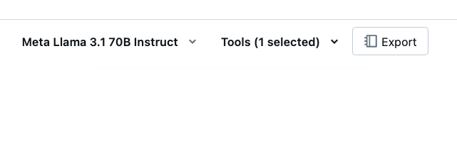

# Agent with custom input

This folder contains a modified version of an agent exported from the Databricks Playground that accepts an optional `email` field as custom input to the model.

This pattern can be used by the calling app to provide additional context to the agent.